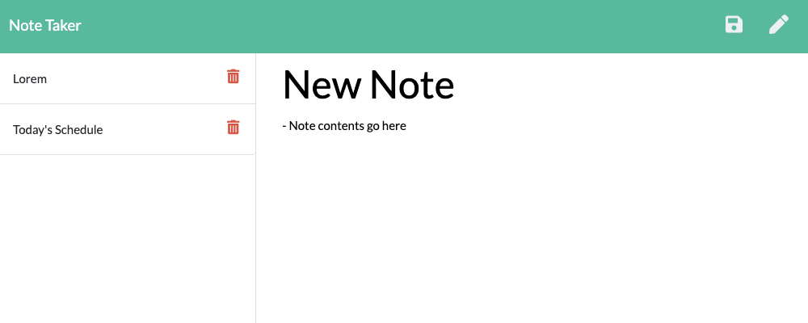

# Note Taker

Typing is an easy and effective way to brainstorm, set goals, and stay organized. The Note Taker web app creates a designated interface for users to write and read notes directly from the browser.

## Usage

Visit the deployed [Note Taker](https://note-taker-rm.herokuapp.com/) web app!
- **Navigate** between notes in the left-hand panel 
- **Delete** a note by clicking its respective trash icon
- **View** and **edit** a selected note in the right-hand panel
- **Save** the current note by clicking the floppy disk icon in the top-right 
- **Create** a new note by clicking the pencil icon in the top-right 

## Installation

- Head over to the [note-taker repository](https://github.com/roccomaniscalco/note-taker)
- Press the green _code_ button and select method of download

## License

Licensed under the [MIT](https://opensource.org/licenses/MIT) license.
